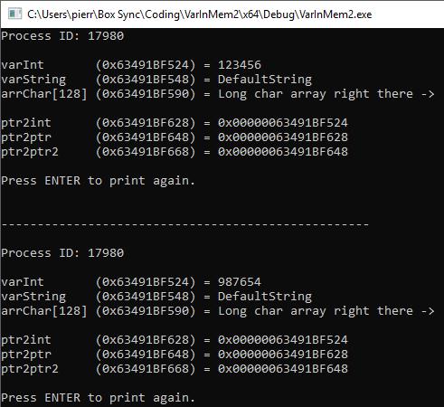

#####  BypaPH - Process Hacker's bypass (read/write any process virtual memory & kernel mem)

任意程序内存读取，支持驱动层

[原帖子 BypaPH - Process Hacker's bypass](
https://www.unknowncheats.me/forum/anti-cheat-bypass/312791-bypaph-process-hackers-bypass-read-write-process-virtual-memory-kernel-mem.html)


##### 例子

```c++
#include <Windows.h>
#include "BypaPH.hpp"
 
#define TARGET_PROCESS 17980
#define ADDR_INT_TO_MANIPULATE (PVOID)0x63491BF524
 
using namespace std;
 
int main(int argc, char *argv[])
{
	auto bypass = new BypaPH(TARGET_PROCESS);
 
	int iReadFromTarget = 0;
	SIZE_T bytesRead = 0;
 
	// Read (safe IOCTL)
	iReadFromTarget = bypass->qRVM<int>(ADDR_INT_TO_MANIPULATE, &bytesRead);
	cout << dec << "iReadFromTarget = " << iReadFromTarget << " | bytesRead = " << bytesRead << endl;
 
	// Write
	int iWriteInTarget = 987654;
	SIZE_T bytesWritten = 0;
	const auto status = bypass->qWVM(ADDR_INT_TO_MANIPULATE, &iWriteInTarget, sizeof(iWriteInTarget), &bytesWritten);
	cout << "qWVM returned 0x" << hex << status << endl;
 
	// Read again (this time with the unsafe IOCTL)
	iReadFromTarget = bypass->qRVMu<int>(ADDR_INT_TO_MANIPULATE, &bytesRead);
	cout << dec << "iReadFromTarget = " << iReadFromTarget << " | bytesRead = " << bytesRead << endl;
 
	delete bypass;
	system("pause");
	return EXIT_SUCCESS;
}
```

##### 运行结果




##### 其他例子


[吃鸡外挂 PUBGM-ESP-AIMBOT](https://github.com/7AM7/PUBGM-ESP-AIMBOT)


